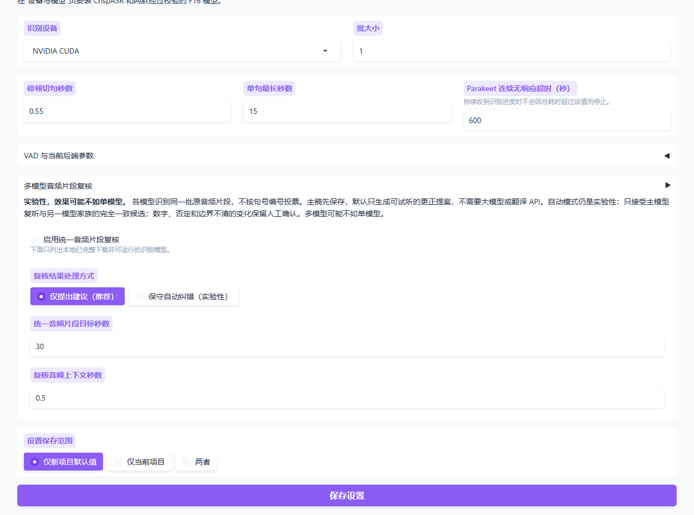
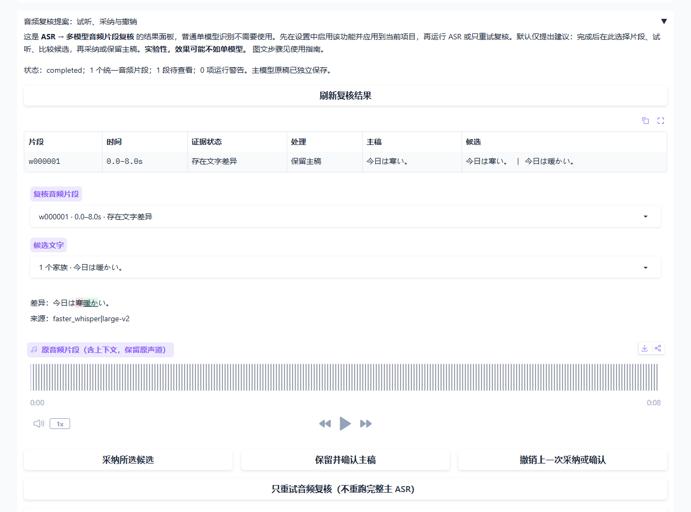

# 多模型音频片段复核：图文教程

**实验性，效果可能不如单模型。** 这是帮你发现不同模型意见的辅助工具，不是保证更准确的自动字幕生成器。普通单模型识别不需要打开“音频复核提案”面板。

默认逻辑：**主模型生成原稿 → 多模型复听同一批音频 → 提出差异 → 你试听并决定是否采纳 → 翻译和配音。**

截图为隔离演示。切换页签保留草稿，刷新浏览器会放弃草稿；保存到“仅当前项目”后，刷新需重开项目再载入项目设置。见[配置参考](CONFIGURATION.md)。

下图来自实际界面的隔离演示项目。演示台词和音频仅用于展示按钮，不是准确率评测；隔离环境未安装 ASR 模型，所以第一张图的启用框是灰色的。你的环境安装模型后会列出可选模型。

## 1. 在设置中启用，而不是直接点击结果面板

打开“设置 → ASR（语音识别）→ 多模型音频片段复核”：

1. 勾选“启用统一音频片段复核”。灰色不可选时，先在“设备与模型”安装识别模型。
2. 在“复核模型”选择辅助模型；不必全选，越多通常耗时越长。主模型本身也会复听。
3. “复核结果处理方式”先保持 **“仅提出建议（推荐）”**。
4. 片段目标秒数和上下文秒数可先保留默认值。
5. 页面底部“设置保存范围”：已有项目选“仅当前项目”，以后新建项目使用则选“仅新项目默认值”，然后点击“保存设置”。

## 2. 运行：新项目和已有项目不一样

| 当前情况 | 点击哪个按钮 |
|---|---|
| 新项目，还没有识别文字 | 工作台的“1 · 运行 ASR（语音识别）” |
| 已有识别原稿，只想补做或重试复核 | “音频复核提案”里的“只重试音频复核（不重跑完整主 ASR）” |
| 只是想查看已经完成的复核结果 | “刷新复核结果” |

“复核完成”表示建议已经生成，**默认不会改变句子表**。不要为了刷新复核结果重跑完整 ASR。主稿先保存，辅助模型异常不会丢掉已完成的原稿。

## 3. 查看差异：先选音频片段，再选候选文字

回到“工作台 → 单个作品”，展开 **“音频复核提案：试听、采纳与撤销”**。这是步骤 1 所启用功能的结果面板。

点击“刷新复核结果”，在“复核音频片段”里选择一项，再从“候选文字”里选择要比较的版本。

| 状态 | 如何处理 |
|---|---|
| 文字一致 | 可以先略过，但不代表一定正确 |
| 存在文字差异 | 重点试听、比较 |
| 证据不足／暂无有效候选 | 不确定时保留原稿，必要时重试 |
| 边界需人工确认 | 不安全的一键替换会被阻止；在句子表中手动校对 |

不同模型把同一段分成一句或多句，本身不算文字错误。程序比较共同音频片段的文字；无法安全定位的重叠边界不会强行按字符切开。

## 4. 听原音频，然后决定

选择候选后会显示差异：划掉的是主稿内容，新增标记是候选内容。下面的播放器播放原音频片段，带前后上下文并保留原声道。

- 候选更符合原音频：点 **“采纳所选候选”**，句子表随之更新。
- 主稿更准确：点 **“保留并确认主稿”**。
- 听不清：不必强行选，先查看下一段。
- 点错：点 **“撤销上一次采纳或确认”**。
- 提示跨边界或时间戳异常：不要把候选全文直接粘贴到每一句；试听后只在句子表改对应内容，避免重复台词。

人工修改或确认过的句子会锁定，旧提案不能覆盖后续编辑。解除锁定按钮只解除保护，不清空文字。采纳修改后，相关翻译、配音和成品需要重新生成。

## 5. 确定文字，再处理时间、翻译、配音

如果时间戳不准确，可点击 **“文字确认后：仅重新对齐时间（Qwen3）”**，需要已安装 Qwen3 ForcedAligner。它只调整时间，不证明文字正确，也不负责改台词。

最后按正常流程翻译、保存校对表格、生成配音和混音。推荐在翻译和配音前完成原文复核。

“保守自动纠错（实验性）”会自动应用少量满足条件的修改，其他仍留给人工；它没有经过你的作品集准确率校准，不保证优于单模型。

## 已有中文字幕，不需要这个功能

如果每条音轨已有可信的中文字幕，在批量页选择对应字幕、“完全采用字幕文字和时间轴（不运行 ASR）”和“中文”。这样直接用字幕生成配音，不需要 ASR、多模型复核或正文翻译。详见[已有字幕制作指南](SUBTITLE_WORKFLOW.md)。
